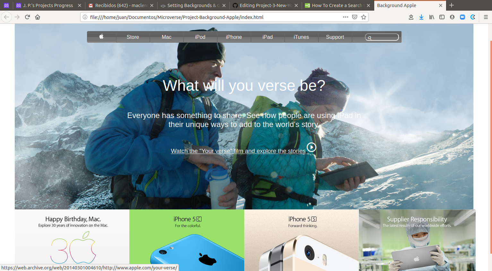

# Apple store clone page

 This page is for training how to use background and gradients, and also to order a webpage. It should look like this [old apple page](https://web.archive.org/web/20140301004610/http://www.apple.com/)

Additional description about the project and its features.

## Built With

- HTML,
- CSS,

## Getting Started

Simply download the zip and decompress. Once decompressed, double click or open index.html in any web browser.

To get a local copy up and running follow these simple example steps.

### Prerequisites

Any web browser will do, Mozilla, Safari, or Chrome.

##Preview

Check preview webpage [here](https://rawcdn.githack.com/Maclenn77/Project-Background-Apple/7336d4943ee32cf4975b4ae309a415b94a9122ac/index.html)

## Authors

👤 **Juan Paulo Perez Tejada**

- Github: [@Maclenn77](https://github.com/Maclenn77)
- Twitter: [@srjuanpapas](https://twitter.com/srjuanpapas)
- Linkedin: [linkedin](https://mx.linkedin.com/in/juanpaulopereztejada )

## 🤝 Contributing

Contributions, issues and feature requests are welcome!

Feel free to check the [issues page](issues/).

## Show your support

Give a ⭐️ if you like this project!

## 📝 License

This project is for microverse course purposes.
